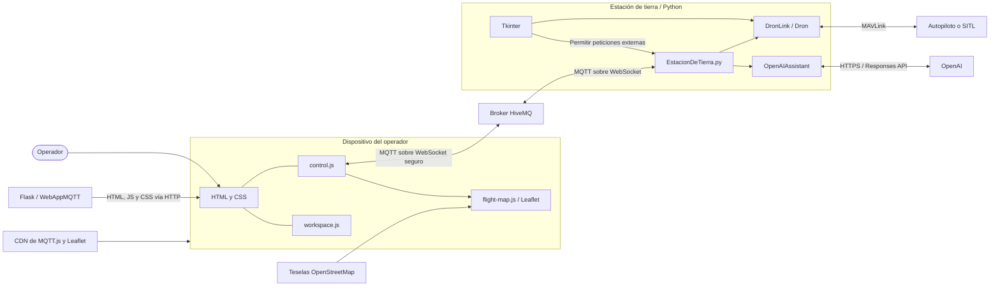
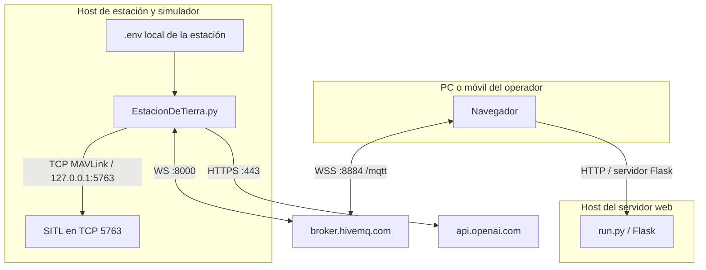
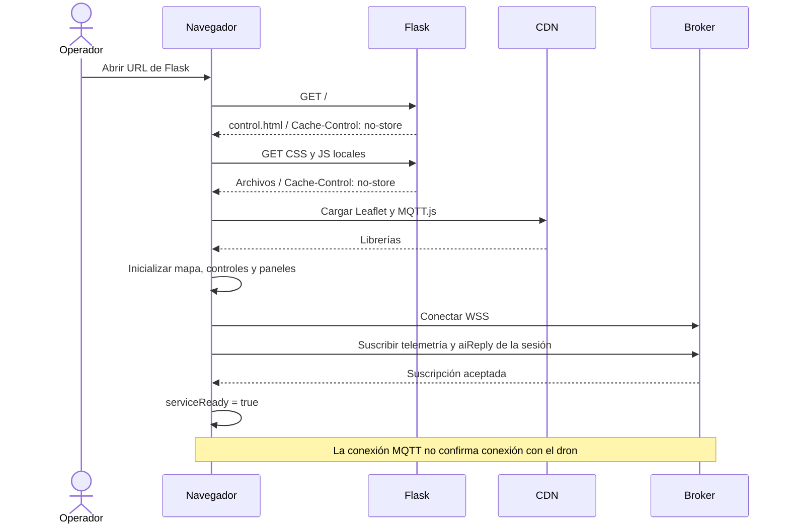

# 01 · Arquitectura

[Índice](README.md) · [Siguiente: interfaz web](02-interfaz-web.md)

## Componentes

## Responsabilidades

| Componente | Responsabilidad |
| --- | --- |
| Flask | Renderizar `control.html`, servir archivos estáticos y desactivar su caché HTTP. |
| Navegador | Publicar solicitudes MQTT, recibir telemetría y respuestas IA, actualizar la UI y mantener datos de sesión. |
| Broker | Distribuir mensajes por suscripción a topics. No interpreta instrucciones del dron. |
| Estación de tierra | Ofrecer controles locales y traducir comandos MQTT a llamadas DronLink o al asistente. |
| DronLink | Gestionar conexión, estado, comandos y mensajes MAVLink. |
| Autopiloto/SITL | Ejecutar el control del vehículo y emitir telemetría. |
| OpenAI | Generar una respuesta de texto a cada consulta independiente. |

Flask no participa en cada comando de vuelo o consulta del chat: tras servir la página, el navegador habla directamente con MQTT.

## Despliegue actual

Los nodos representan roles que pueden compartir un mismo ordenador. La dirección `127.0.0.1` de la estación exige que el SITL esté en ese host salvo modificación de la configuración. `baud=115200` se pasa a DronLink aunque la conexión configurada sea TCP.

## Carga de la página

## Fuentes

- [Arranque](../WebAppMQTT/run.py), [factoría Flask](../WebAppMQTT/app/__init__.py), [ruta](../WebAppMQTT/app/routes.py).
- [Cliente web](../WebAppMQTT/app/static/js/control.js), [estación](../EstacionTierra/EstacionDeTierra.py), [asistente](../EstacionTierra/openai_assistant.py).
