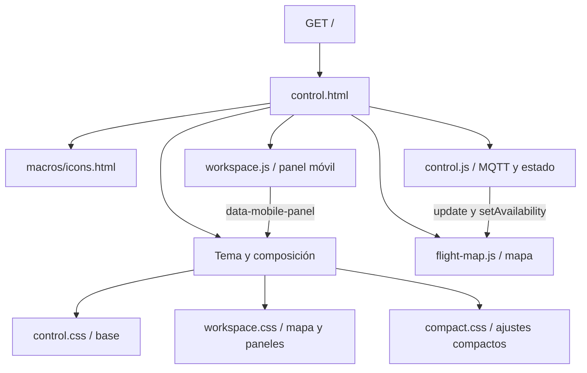
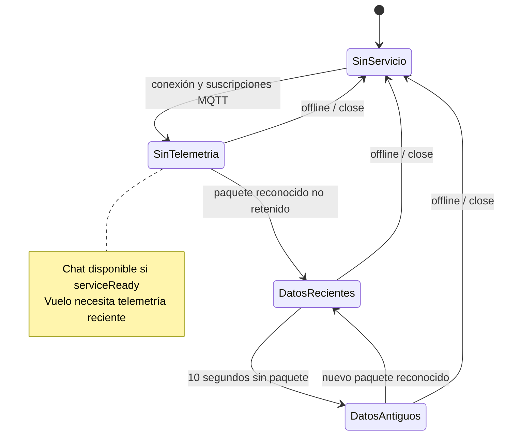

# 02 · Interfaz web

[Índice](README.md) · [Anterior](01-arquitectura.md) · [Siguiente](03-protocolo-mqtt.md)

## Organización

El mapa ocupa el viewport. Los controles y datos se disponen sobre él en paneles compactos. En escritorio hay controles a la izquierda, telemetría a la derecha, herramientas del mapa en la zona inferior y una barra de asistente al pie. En pantallas de hasta 1023 px, la barra móvil permite elegir un panel o esconderlo.

Los estilos se cargan en el orden base → workspace → compact. Los scripts locales se cargan con `defer`, después de las referencias a las librerías externas. Los JavaScript están encapsulados en funciones autoejecutadas; no son clases.

## Elementos interactivos

| Elemento | Comportamiento |
| --- | --- |
| Conectar | Solicita conexión de la estación al SITL. |
| Despegar | Solicita armado y despegue inicial a 1 m. |
| Altitud + aplicar | Selecciona metros enteros positivos y solicita la altura relativa en vuelo. |
| Rosa de los vientos | Ocho direcciones geográficas; N arriba, sin depender del rumbo del dron. |
| Pausa central | Envía `go` con `Stop`. |
| Velocidad + aplicar | Solicita velocidad horizontal entre 0,5 y 5 m/s. |
| Aterrizar | Solicita `Land`. |
| Centrar, seguir, trayectoria y limpiar | Operaciones locales de visualización; no mueven el dron. |
| Datos | Altitud, velocidad medida, rumbo, modo, latitud y longitud. |
| Actividad y CSV | Registro local de hasta 100 eventos, exportable desde el navegador. |
| Asistente | Envía texto a la estación, muestra espera, respuesta o error. |
| Guía de iconos | Leyenda desplegable con los SVG del mismo catálogo que los controles. |

Los botones tienen nombres accesibles y tooltips. Las acciones conservan el SVG al cambiar de estado; `actionLabel()` actualiza un `span` y atributos como `aria-busy`. Las áreas de pulsación de la rosa de los vientos son de 44 × 44 px.

## Estado local de control.js

| Variable | Significado |
| --- | --- |
| `serviceReady` | Conexión MQTT y suscripciones completadas. |
| `state` | Último estado de dron reconocido en telemetría. |
| `lastTelemetry`, `telemetryValid` | Referencia temporal y validez del paquete recibido. |
| `pending` | Solicitud de conexión, despegue o aterrizaje pendiente. |
| `pendingAltitude`, `pendingSpeed` | Solicitudes de ajuste pendientes de confirmación por datos. |
| `selectedDirection` | Última dirección solicitada y resaltada. |
| `configuredSpeed` | Velocidad configurada informada por la estación. |
| `events` | Registro local, sin base de datos. |
| `aiSession`, `pendingAI` | Identificación del navegador y consulta IA pendiente. |

`render()` calcula qué acciones se pueden realizar. Disponer de un paquete válido no garantiza que todos sus valores sean válidos: cada medición se formatea y comprueba por separado.

Una pérdida de servicio conserva las mediciones visibles como antiguas. Vacía las solicitudes pendientes y no las reenvía. La disponibilidad del mapa también se actualiza.

## Paneles móviles

`workspace.js` mantiene `body.dataset.mobilePanel` con `flight`, `data`, `map` o `none`. Pulsar de nuevo el panel activo lo oculta. Un cambio de breakpoint vuelve a seleccionar vuelo. El enlace de salto abre vuelo y lleva su scroll al inicio.

## Fuentes

[Plantilla](../WebAppMQTT/app/templates/control.html) · [Iconos](../WebAppMQTT/app/templates/macros/icons.html) · [Lógica](../WebAppMQTT/app/static/js/control.js) · [Paneles](../WebAppMQTT/app/static/js/workspace.js) · [Estilos compactos](../WebAppMQTT/app/static/css/compact.css).
