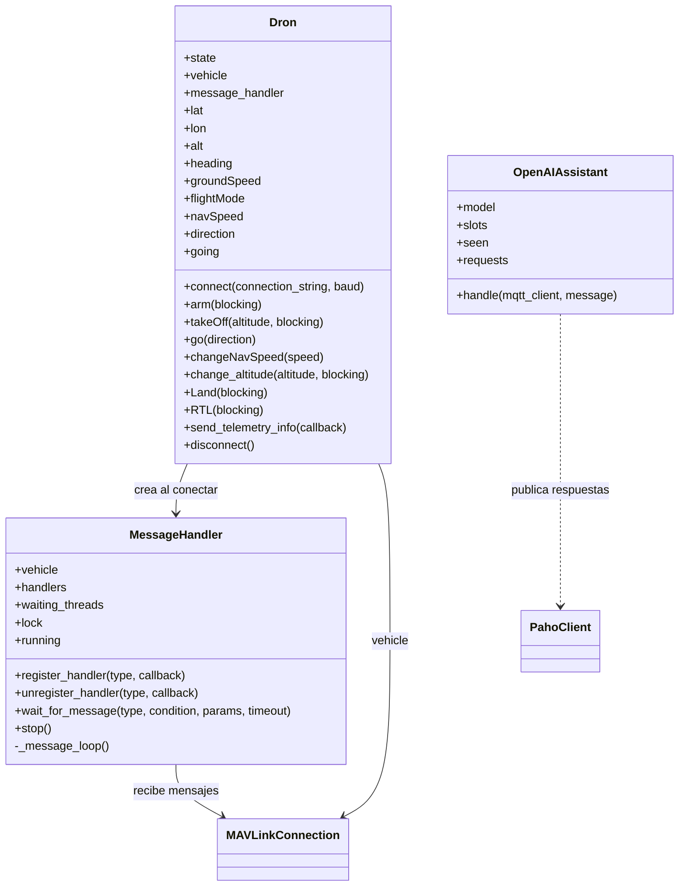
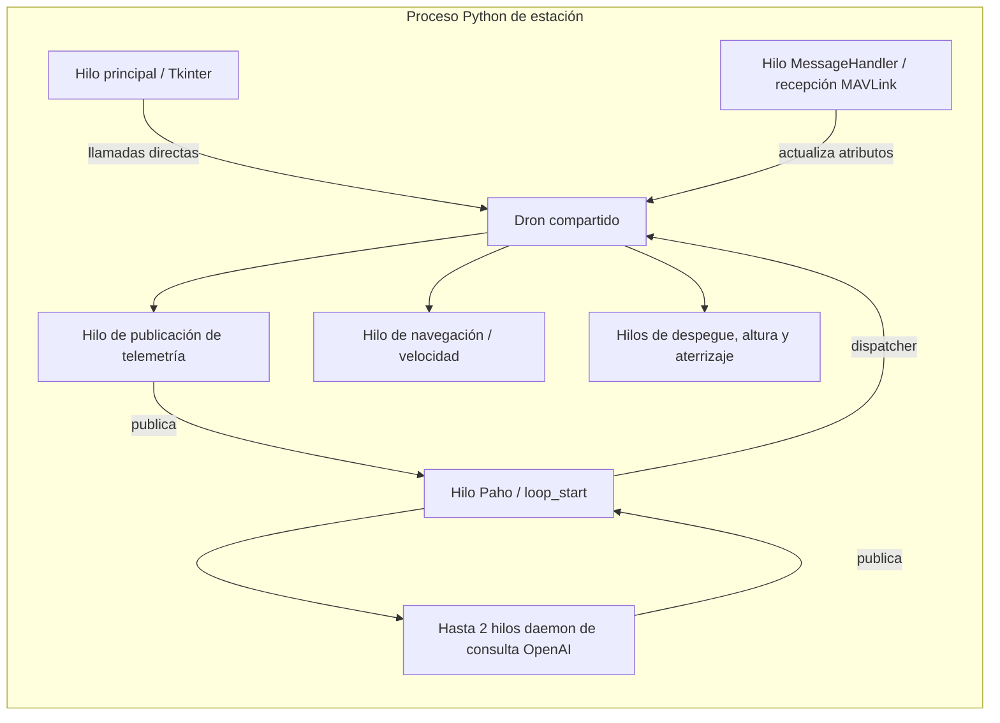
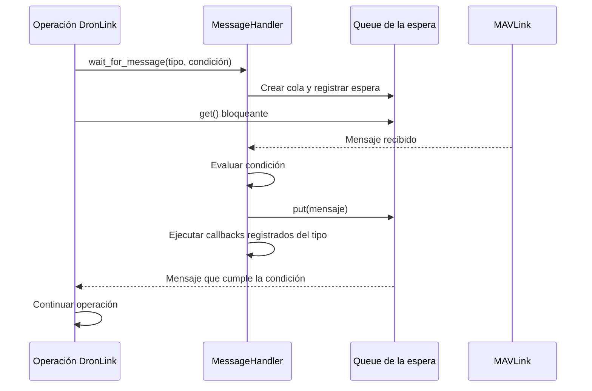

# 04 · Estación de tierra y DronLink

[Índice](README.md) · [Anterior](03-protocolo-mqtt.md) · [Siguiente](05-control-de-vuelo.md)

## Estación de tierra

`EstacionDeTierra.py` es un script con funciones y objetos globales; no define una clase de estación. Al ejecutarse importa DronLink, crea `OpenAIAssistant`, instancia `Dron`, construye una ventana Tkinter y entra en `mainloop()`.

| Función | Responsabilidad |
| --- | --- |
| `allowExternal()` | Crear cliente Paho WebSocket, registrar callbacks, conectar al broker e iniciar `loop_start()`. |
| `on_connect()` | Suscribirse al prefijo de comandos cuando se conecta o reconecta. |
| `on_message()` | Comprobar estructura del topic y despachar `aiMessage` o comandos del dron. |
| `procesarTelemetria()` | Copiar los datos DronLink, añadir `navSpeed` y publicar JSON. |
| `publish_event()` | Publicar eventos heredados de callbacks de operaciones. |

La ventana ofrece conectar, armar, despegar, N/S/E/O, detener, RTL, desconectar y permitir peticiones externas. Los botones locales llaman directamente a `dron`; no pasan por MQTT. El botón local de despegue usa 3 m y requiere armado previo. La web solicita armado y despegue a 1 m en una operación.

## Clases y dependencias

Las operaciones de `Dron` se importan dentro de la definición de la clase desde `modules/*.py`. Es una fachada con métodos distribuidos entre archivos, no una jerarquía de subclases por operación. El asistente no tiene relación con `Dron` ni importa DronLink.

## Concurrencia

La llamada a OpenAI no bloquea el callback MQTT. Despegue, cambio de altura y aterrizaje se solicitan con `blocking=False`; conexión y armado desde MQTT siguen siendo bloqueantes. Las llamadas Tkinter que usan el valor predeterminado `blocking=True` pueden bloquear temporalmente la ventana. No hay un coordinador único de operaciones ni bloqueo global de todos los atributos de `Dron`.

## MessageHandler

El gestor distribuye los mensajes de `vehicle.recv_match()` a:

- **Callbacks registrados:** por ejemplo, `GLOBAL_POSITION_INT` para actualizar medidas y `HEARTBEAT` para el modo.
- **Esperas con cola:** `wait_for_message()` registra una cola y una condición; el hilo receptor deposita el mensaje que cumple la condición.

Este gestor centraliza las lecturas gestionadas por DronLink. Existen además llamadas a helpers de pymavlink, como `motors_armed_wait()` y `motors_disarmed_wait()`. Varias esperas de operaciones no tienen timeout explícito, por lo que el timeout de la UI no termina por sí mismo el hilo de la estación.

## Inventario de la librería incluida

| Archivo en `dronLink/modules` | Función | Uso actual |
| --- | --- | --- |
| `dron_connect.py` | Conexión y actualización de medidas/estado. | Estación y web. |
| `dron_arm.py` | Armado y cambio de modo. | Estación y despegue web. |
| `dron_takeOff.py` | Despegue y espera de altura. | Estación y web. |
| `dron_RTL_Land.py` | RTL y aterrizaje. | Land en web; RTL también en Tkinter. |
| `dron_nav.py` | Navegación por velocidad, diagonales, rumbo. | Dirección y velocidad web; resto disponible en Dron. |
| `dron_altitude.py` | Altura relativa manteniendo latitud/longitud del destino. | Selector web. |
| `dron_telemetry.py` | Publicación periódica de medidas. | Web mediante callback de estación. |
| `message_handler.py` | Recepción y reparto de mensajes. | Infraestructura del enlace. |
| `dron_local_telemetry.py` | Datos locales NED. | Método de Dron, sin suscripción web específica. |
| `dron_goto.py` | Ir a coordenadas. | Importado por Dron; sin comando web actual. |
| `dron_parameters.py` | Consultar/modificar parámetros. | Importado por Dron; sin UI web. |
| `dron_geofence.py` | Escenarios de geofence. | Importado por Dron; sin UI web. |
| `dron_mission.py` | Leer, cargar y ejecutar misiones. | Importado por Dron; sin UI web. |
| `dron_move.py` | Movimiento por distancia y velocidad asociada. | Importado por Dron; sin UI web. |
| `dron_bottomGeofence.py` | Comprobación de altura mínima. | Importado por Dron; no activado por esta UI. |
| `dron_drop.py` | Acción de drop. | Importado por Dron; sin UI web. |
| `dron_flightPlan.py`, `dron_mov.py` | Funciones alternativas de planificación/movimiento. | Archivos presentes, no importados por la fachada actual. |
| `dron_localGeofence.py`, `dron_setGeofence.py` | Otras funciones de geofence. | Archivos presentes, no importados por la fachada actual. |
| `dron_RC_overrride.py` | Override RC. | Archivo presente, no importado por la fachada actual. |

La presencia de un método en la librería no implica que esté validado, expuesto por MQTT o disponible desde el chat.

## Fuentes

[Estación](../EstacionTierra/EstacionDeTierra.py) · [Dron](../EstacionTierra/dronLink/Dron.py) · [MessageHandler](../EstacionTierra/dronLink/modules/message_handler.py) · [Módulos](../EstacionTierra/dronLink/modules/).
