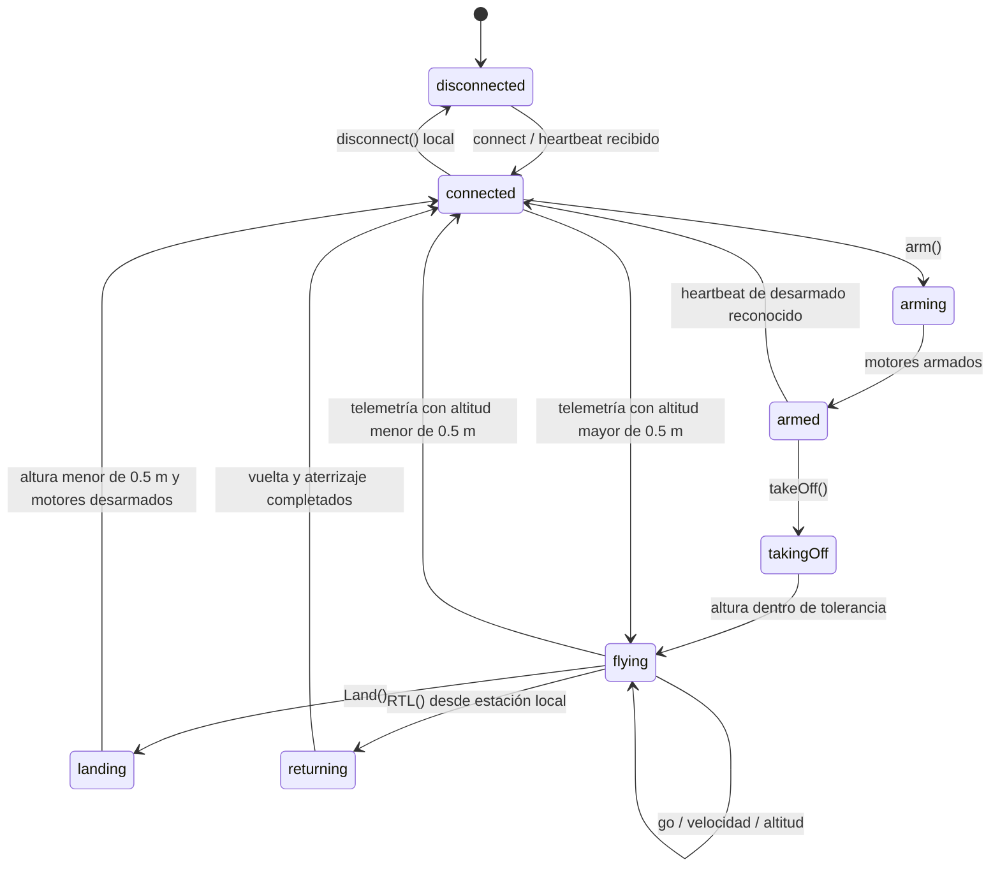
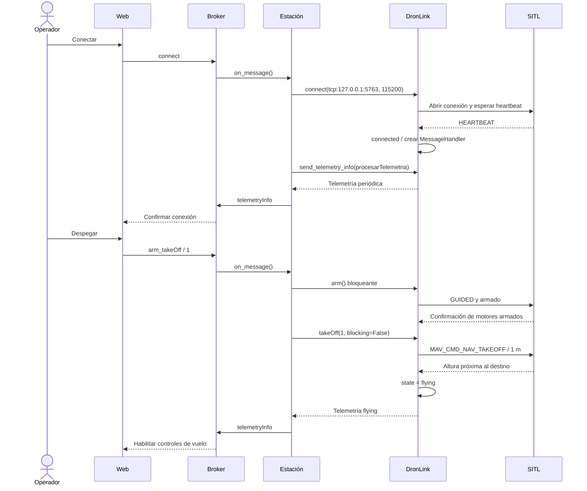
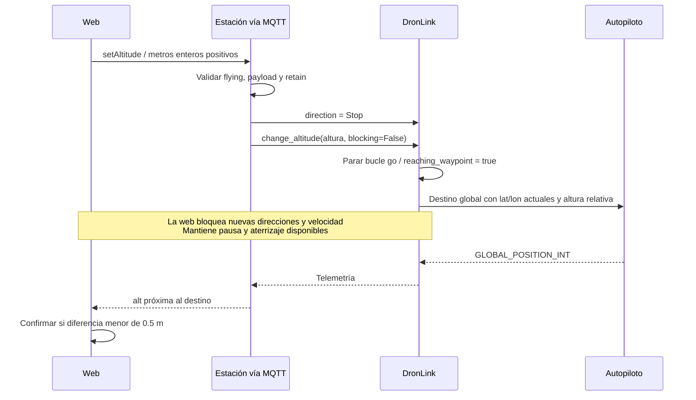
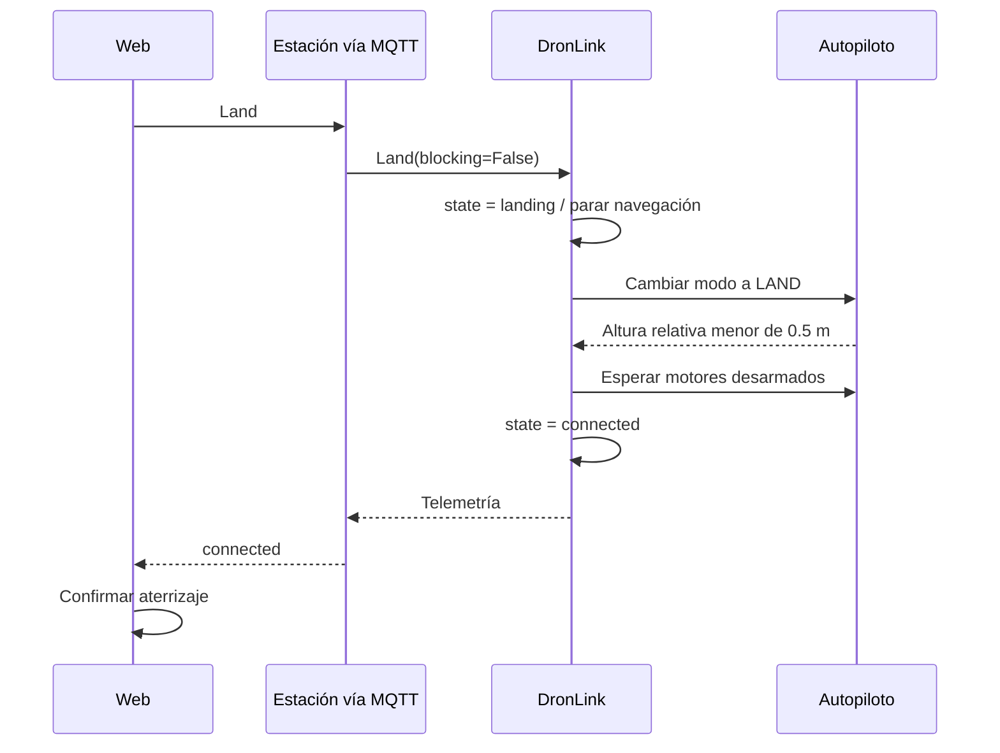

# 05 · Control de vuelo

[Índice](README.md) · [Anterior](04-estacion-y-dronlink.md) · [Siguiente](06-telemetria-y-mapa.md)

## Estados del dron

Es un resumen de las transiciones implementadas en DronLink, no una máquina formal del autopiloto. `connecting` figura entre las etiquetas aceptadas por la web, pero `connect()` de esta fachada no asigna ese estado: «Conectando» en la UI se representa mediante una solicitud pendiente.

La frescura de datos y las solicitudes pendientes son estados de la web independientes de `dron.state`.

## Conectar, armar y despegar

La estación fija 1 m para el despegue web aunque otro payload indique una altura distinta. `_checkAltitudeReached()` utiliza una tolerancia alrededor del destino de aproximadamente ±0,5 m. La altura seleccionada en la UI se aplica posteriormente mediante otro comando.

## Navegación geográfica y pausa

`go(direction)` prepara velocidades en ejes norte/este y arranca el hilo de navegación si es necesario. Este hilo envía `self.cmd` aproximadamente cada segundo mientras `going` sea verdadero.

| Dirección | Componentes horizontales conceptuales |
| --- | --- |
| Norte / Sur | ± velocidad en eje norte. |
| Este / Oeste | ± velocidad en eje este. |
| Diagonal | Ambos ejes a ± `navSpeed / sqrt(2)`. |
| Stop / pausa | Velocidad horizontal y vertical nulas. |

La normalización evita que una diagonal tenga una magnitud mayor que la velocidad seleccionada. La rosa de los vientos representa direcciones geográficas; no gira con el heading. El resaltado muestra la última solicitud enviada.

`go('Stop')` mantiene el modo de navegación enviando velocidad cero. `_stopGo()` hace otra cosa: pone `going=False` para parar el bucle de envío, como parte del cambio de altura o aterrizaje.

## Cambio de altitud

El destino usa la latitud y longitud almacenadas por DronLink al construir el comando. Pausa o aterrizaje pueden sustituir el control durante la espera. La web cancela su espera al solicitar estas acciones; no hay un token de cancelación que retire la espera interna de `change_altitude()`.

## Cambio de velocidad

La estación acepta valores finitos entre 0,5 y 5 m/s en tierra o en vuelo. `changeNavSpeed()` guarda el valor y vuelve a invocar `go(self.direction)`. La web confirma cuando recibe ese mismo `navSpeed` en telemetría. `groundSpeed` continúa siendo la velocidad medida.

## Aterrizaje

## Plazos en la UI

| Espera | Plazo | Resultado al agotarse |
| --- | --- | --- |
| Conexión | 15 s | Aviso de falta de confirmación y retirada de espera local. |
| Despegue / aterrizaje | 60 s | Aviso y retirada de espera local. |
| Altitud | 60 s | «Altitud sin confirmar». |
| Velocidad | 10 s | «Cambio sin confirmar». |

Estos plazos se revisan con un temporizador de 1 s. No cancelan operaciones en el autopiloto ni sus hilos DronLink. Si falta telemetría reciente, la UI deshabilita acciones de vuelo, incluida pausa/aterrizaje; los controles locales de estación siguen siendo otra vía.

## Fuentes

[Control web](../WebAppMQTT/app/static/js/control.js) · [Dispatcher](../EstacionTierra/EstacionDeTierra.py) · [Armado](../EstacionTierra/dronLink/modules/dron_arm.py) · [Despegue](../EstacionTierra/dronLink/modules/dron_takeOff.py) · [Navegación](../EstacionTierra/dronLink/modules/dron_nav.py) · [Altitud](../EstacionTierra/dronLink/modules/dron_altitude.py) · [Aterrizaje](../EstacionTierra/dronLink/modules/dron_RTL_Land.py).
