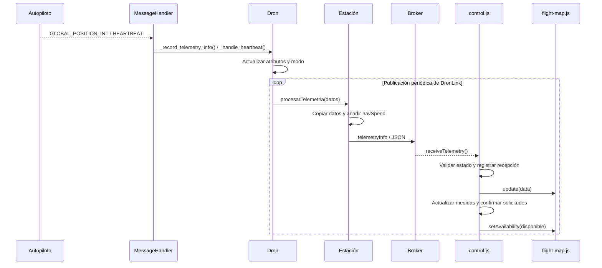
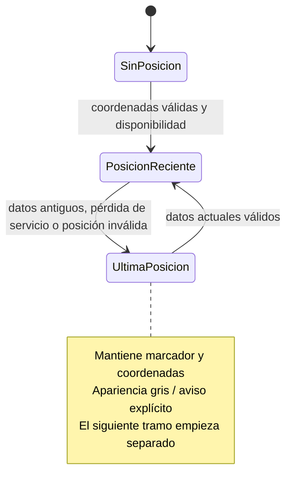
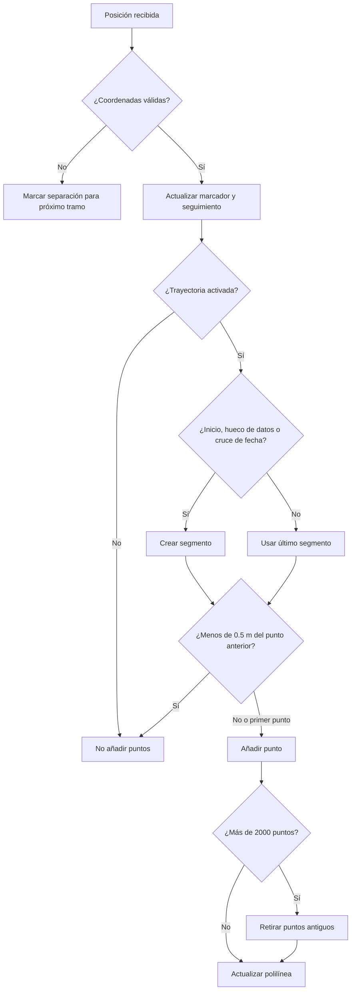

# 06 · Telemetría y mapa

[Índice](README.md) · [Anterior](05-control-de-vuelo.md) · [Siguiente](07-asistente-openai.md)

## Recorrido de las medidas

La conexión solicita mensajes globales y locales a la frecuencia de DronLink, que por defecto es 10 Hz. El hilo de publicación produce un snapshot de los atributos a esa frecuencia; no equivale necesariamente a una muestra nueva del sensor en cada publicación.

## Conversión de unidades

| Origen MAVLink | Conversión en DronLink | Valor web |
| --- | --- | --- |
| `lat`, `lon` | División por `10^7`. | Grados, seis decimales. |
| `relative_alt` | División por 1000. | Metros, un decimal. |
| `hdg` | División por 100. | Grados; flecha de orientación. |
| `vx`, `vy` | `sqrt(vx² + vy²) / 100`. | Velocidad horizontal, m/s. |
| `HEARTBEAT` | `mode_string_v10()`. | Modo de vuelo. |

`_record_telemetry_info()` también reconoce `connected → flying` cuando `alt > 0.5` y `flying → connected` cuando `alt < 0.5`.

## Disponibilidad y validez

La web requiere MQTT listo, paquete de estado reconocido y menos de 10 s desde su recepción para considerar recientes los datos. Un valor numérico ausente o fuera de rango se muestra como «Sin datos». El mapa valida latitud en [-90, 90], longitud en [-180, 180] y rumbo en [0, 360].

La antigüedad se calcula por recepción en el navegador. No hay verificación de antigüedad real del sensor en origen. Una posición (0, 0) está dentro del rango admitido; no hay filtro adicional para distinguirla de un valor inicial de DronLink.

## Mapa y orientación

- Leaflet carga teselas de OpenStreetMap, con zoom máximo 19 y norte arriba.
- La rueda del ratón acerca/aleja alrededor del cursor; los paneles conservan su propio scroll.
- La primera posición válida centra con zoom 17.
- Con heading válido, el marcador usa una flecha cuyo elemento interno rota. Leaflet conserva el transform de posicionamiento del contenedor.
- Sin heading válido, el marcador usa un punto. Con datos antiguos, conserva la última posición con otro aspecto.
- «Seguir» centra en cada actualización. Arrastrar el mapa o moverlo con las flechas del teclado desactiva el seguimiento.
- «Centrar» utiliza al menos zoom 17. El cálculo considera los paneles para ubicar el dron en el área visible del mapa.
- `ResizeObserver` observa mapa y paneles, invalida el tamaño de Leaflet y recentra cuando el seguimiento está activo.

## Trayectoria opcional

Desactivada por defecto. Apagarla oculta la polilínea, pausa el registro y conserva los puntos. Reactivarla inicia un segmento nuevo; evita unir intervalos omitidos. Se separan también huecos de datos y cruces de longitud mayores de 180°. «Limpiar» elimina puntos y segmentos; recargar pierde toda la trayectoria local.

La trayectoria representa las posiciones recibidas mientras la opción está activa, no una misión planificada ni una ruta que el dron deba ejecutar.

## Fuentes

[Adquisición](../EstacionTierra/dronLink/modules/dron_connect.py) · [Publicación](../EstacionTierra/dronLink/modules/dron_telemetry.py) · [Recepción web](../WebAppMQTT/app/static/js/control.js) · [Mapa](../WebAppMQTT/app/static/js/flight-map.js).
