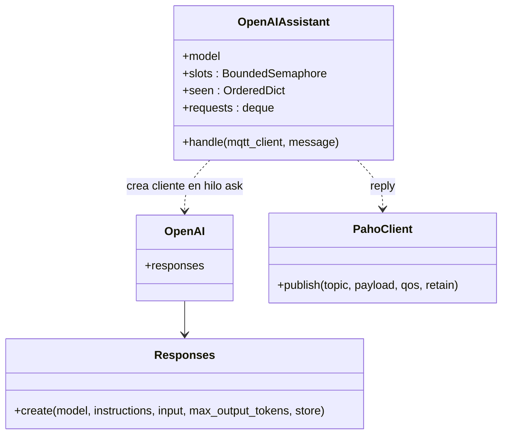
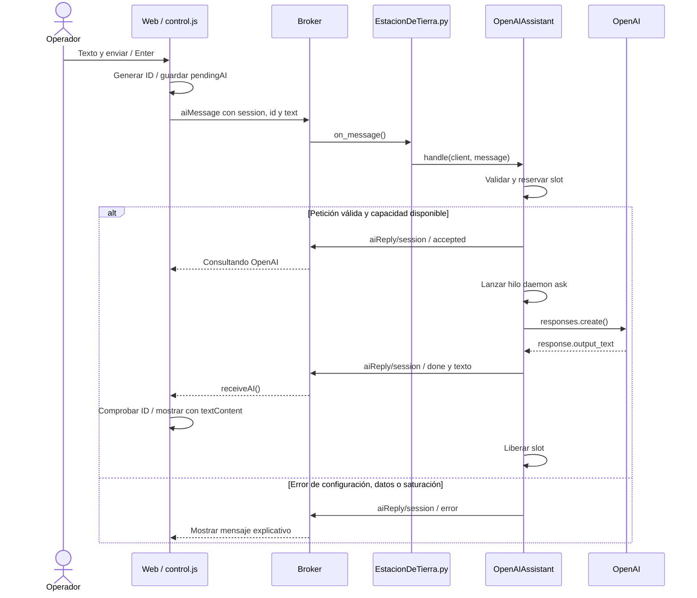
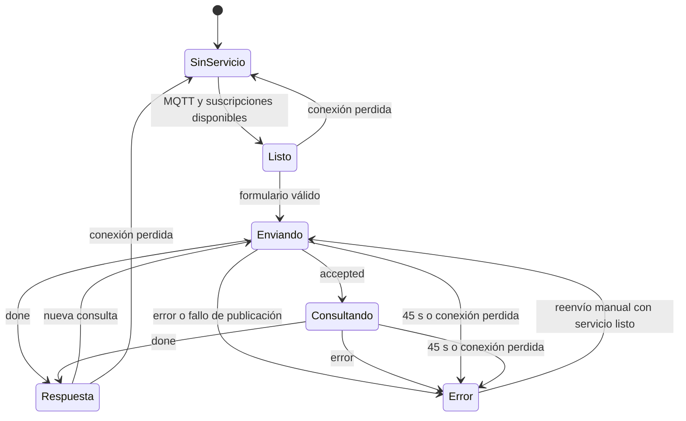

# 07 · Asistente OpenAI

[Índice](README.md) · [Anterior](06-telemetria-y-mapa.md) · [Siguiente](08-operacion-y-limites.md)

## Alcance actual

La PoC conecta texto de la web con OpenAI a través de la estación. Cada consulta es independiente, sin historial ni telemetría. Las respuestas son texto completo, sin streaming. El modelo no dispone de herramientas que llamen a DronLink y el código no interpreta su respuesta como una orden.

Las instrucciones enviadas al modelo indican que responda brevemente en español y que, ante una petición de movimiento, explique que la PoC todavía no la ejecuta. El aislamiento funcional también está en el código: `OpenAIAssistant` no importa `Dron` ni publica comandos de vuelo.

## Estructura del asistente

`reply()` y `ask()` son funciones anidadas en `handle()`. Capturan el cliente MQTT, ID y topic de la petición; no son métodos adicionales de la clase. El semáforo limita las llamadas simultáneas, el diccionario recuerda peticiones recientes y la cola temporal limita admisiones por minuto.

## Secuencia completa

Si la consulta HTTP falla, el hilo publica `error` y libera el slot mediante `finally`. Peticiones malformadas sin identificadores válidos, retenidas o demasiado grandes se descartan sin respuesta. Una repetición reciente del mismo par sesión/ID también se descarta sin reenviar el resultado anterior.

## Sesión y correlación

| Identificador | Creación | Duración | Uso |
| --- | --- | --- | --- |
| `aiSession` | En el navegador, al ejecutar la página. | Hasta recargar o cerrar esa carga de página. | Sufijo del topic de respuesta. |
| `id` | En el navegador, en cada envío. | Una petición. | Emparejar respuesta con `pendingAI`. |
| `(session, id)` | Combinación en la estación. | Últimas 256 admisiones/validaciones recordadas. | Descartar duplicados recientes. |

Se usa `crypto.randomUUID()` cuando está disponible, con alternativa basada en `crypto.getRandomValues()`. Los IDs sirven para enrutar y correlacionar; no representan autenticación ni confidencialidad.

## Estados de la UI

Mientras hay una consulta pendiente se deshabilitan el input y enviar. Una nueva consulta oculta la respuesta previa. No hay lista de mensajes ni almacenamiento de conversaciones. Las respuestas tardías tras retirar `pendingAI` se ignoran, aunque OpenAI haya procesado la petición.

## Configuración y límites

| Ajuste | Implementación actual |
| --- | --- |
| Clave | `OPENAI_API_KEY`, cargada por la estación. |
| Modelo | `OPENAI_MODEL`; valor predeterminado en código: `gpt-4.1-mini`. |
| Archivo | `.env` junto a `openai_assistant.py`, con variables de entorno prioritarias. |
| Texto | Entre 1 y 1500 caracteres; payload total MQTT máximo 8192 bytes. |
| IDs admitidos | 16–64 caracteres alfanuméricos o guion. |
| Concurrencia | Máximo 2 consultas simultáneas. |
| Frecuencia | Hasta 30 consultas admitidas por minuto en esa instancia de estación. |
| Timeout HTTP | 30 s configurados en el SDK; sin reintentos automáticos. |
| Espera UI | 45 s, comprobada cada segundo. |
| Salida | Máximo 512 tokens configurados. |
| Almacenamiento API solicitado | `store=False`; no se encadenan respuestas anteriores. |

La estación carga la configuración al construir el asistente. Modificar el archivo requiere reiniciar el proceso. La clave no entra en HTML, payloads MQTT ni respuestas. El campo del asistente es para consultas, no para credenciales.

La ausencia del SDK o de la clave devuelve un error explicativo al consultar y no impide por sí misma los controles manuales del dron. La estación necesita sus otras dependencias habituales para iniciar.

## Tratamiento de errores

El código traduce autenticación inválida, permisos, modelo inexistente, cuota/límite, timeout y conexión fallida a mensajes comprensibles. Para otros fallos utiliza una respuesta genérica. No publica la excepción HTTP completa; en consola escribe el nombre de su clase. Una respuesta sin texto también produce `error`.

El broker público permite observar mensajes y publicar solicitudes. El canal por sesión no es privado y el límite de concurrencia no es control de acceso. Los IDs permiten que la UI descarte mensajes ajenos por correlación, pero no prueban quién los ha publicado.

## Funciones futuras no implementadas

Todavía no hay memoria conversacional, geocodificación de lugares, planificación de rutas, interpretación estructurada de órdenes, acceso del modelo a telemetría ni ejecución/confirmación de herramientas del dron. Solicitar «dirígete al Canal Olímpic» actualmente obtiene una respuesta de texto.

## Fuentes y guía de uso

[Asistente](../EstacionTierra/openai_assistant.py) · [Despacho MQTT](../EstacionTierra/EstacionDeTierra.py) · [Cliente web](../WebAppMQTT/app/static/js/control.js) · [Configuración paso a paso](../EstacionTierra/README-OpenAI.md) · [Plantilla sin secretos](../EstacionTierra/.env.example).
