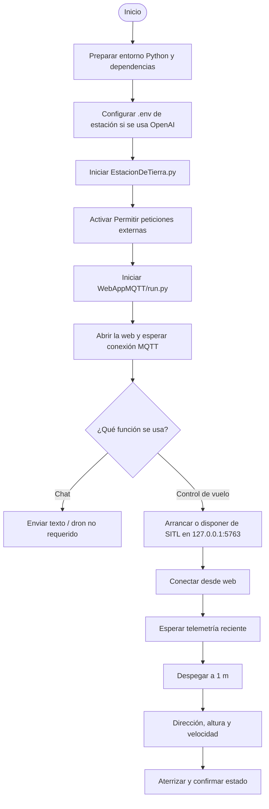
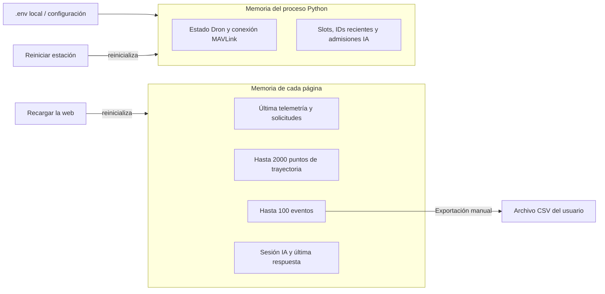

# 08 · Operación, persistencia y límites

[Índice](README.md) · [Anterior](07-asistente-openai.md)

## Arranque

Es un orden orientativo: el simulador puede arrancarse antes. La estación necesita Paho y pymavlink; Flask sirve la web; el asistente añade las dependencias de `EstacionTierra/requirements-ai.txt`. Los controles de vuelo requieren conexión al vehículo y datos recientes. El chat solo exige web/estación conectadas al broker, configuración API y acceso a Internet desde la estación.

`run.py` arranca Flask en modo debug con la configuración predeterminada. Las opciones de escuchar en `0.0.0.0` o usar certificados están comentadas. Abrir desde otro dispositivo requiere configurar un host accesible y la red correspondiente.

## Dónde viven los datos

No hay base de datos ni almacenamiento de vuelos/chat en el servidor Flask. Recargar pierde trayectoria, actividad local y sesión de asistente; si el dron sigue conectado y publicando, la nueva página puede recuperar su estado por telemetría. La recarga no manda aterrizar ni desconectar el dron.

## Caché y actualizaciones

Flask configura `SEND_FILE_MAX_AGE_DEFAULT=0` y añade `Cache-Control: no-store` a sus respuestas, incluidos HTML, JS y CSS locales. Las teselas y librerías de terceros siguen las cabeceras de sus propios servidores.

| Cambio | Acción necesaria |
| --- | --- |
| HTML/CSS/JS | Recargar la web para cargar y ejecutar los archivos nuevos. |
| Código/configuración Flask | Reiniciar el servidor cuando no se haya recargado automáticamente. |
| Estación, DronLink o `.env` | Reiniciar la estación. |
| Copias previas con políticas antiguas | Puede ser necesaria una recarga forzada inicial. |

Una página ya abierta conserva su JavaScript en memoria hasta recargarla aunque las respuestas nuevas tengan `no-store`.

## Fallos y respuesta implementada

| Situación | Respuesta actual |
| --- | --- |
| Broker desconectado | Reintento web cada 2 s, invalidación de telemetría y retirada de solicitudes pendientes. |
| Falta de telemetría durante 10 s | Datos antiguos visibles, acciones de vuelo deshabilitadas, última posición conservada. |
| Operación sin confirmar | Aviso tras el plazo; no cancela la operación en el vehículo. |
| Leaflet no cargado | Aviso de mapa no disponible; los datos siguen siendo otra vía de lectura. |
| Error de teselas | Aviso; una carga posterior sin errores puede retirarlo. |
| MQTT.js no cargado | Aviso de comunicación no disponible; no se crea el cliente. |
| OpenAI no responde/error de cuenta | Mensaje en la barra del asistente; sin ejecución de órdenes. |
| Estación no recibe la consulta IA | La web retira la espera a los 45 s y pide comprobar las peticiones externas. |

## Alcance experimental y limitaciones

Estas son propiedades observables del código actual, no garantías de operación:

- Los topics de vuelo son compartidos: varios usuarios pueden enviar órdenes al mismo dron. No hay exclusión de control, identificación de piloto ni arbitraje.
- El broker actual es público y no autentica estos intercambios. La clave OpenAI permanece local, pero su endpoint MQTT puede recibir consultas de otros clientes.
- Las validaciones de UI no sustituyen validaciones de estación. Algunas rutas del dispatcher carecen de comprobación explícita de retenidos/payloads.
- QoS 0 permite pérdida de mensajes; no hay transacciones ni confirmación correlacionada por ID para los comandos de vuelo.
- La frescura se mide por recepción local. El paquete no lleva timestamp de sensor y su estado es el de la fachada Dron, no una garantía física independiente.
- Pausa, cambio de altura y aterrizaje pueden sustituir comandos del vehículo, pero las esperas internas no tienen cancelación coordinada. No existe un gestor global de operaciones concurrentes.
- Algunas operaciones bloquean el callback MQTT o la ventana Tkinter. La consulta OpenAI sí se separa en un hilo.
- Los plazos de UI no son un failsafe del autopiloto. La aplicación no implementa reacción automática ante pérdida de enlace.
- Los documentos se han elaborado por lectura del código; no constituyen resultados de pruebas de vuelo, rendimiento o validación visual de diagramas.

## Mantener esta documentación

| Al modificar… | Revisar… |
| --- | --- |
| Topics, payloads o callbacks MQTT | [Protocolo](03-protocolo-mqtt.md) y secuencias afectadas. |
| Estados o guardas Dron/UI | [Vuelo](05-control-de-vuelo.md), [interfaz](02-interfaz-web.md). |
| Datos, conversiones o mapa | [Telemetría y mapa](06-telemetria-y-mapa.md). |
| Prompt, memoria, modelo o herramientas IA | [Asistente](07-asistente-openai.md) y guía de configuración. |
| Hosts, dependencias o persistencia | [Arquitectura](01-arquitectura.md) y este documento. |

## Fuentes

[Flask](../WebAppMQTT/app/__init__.py) · [Arranque](../WebAppMQTT/run.py) · [Control](../WebAppMQTT/app/static/js/control.js) · [Mapa](../WebAppMQTT/app/static/js/flight-map.js) · [Estación](../EstacionTierra/EstacionDeTierra.py) · [Asistente](../EstacionTierra/openai_assistant.py).
